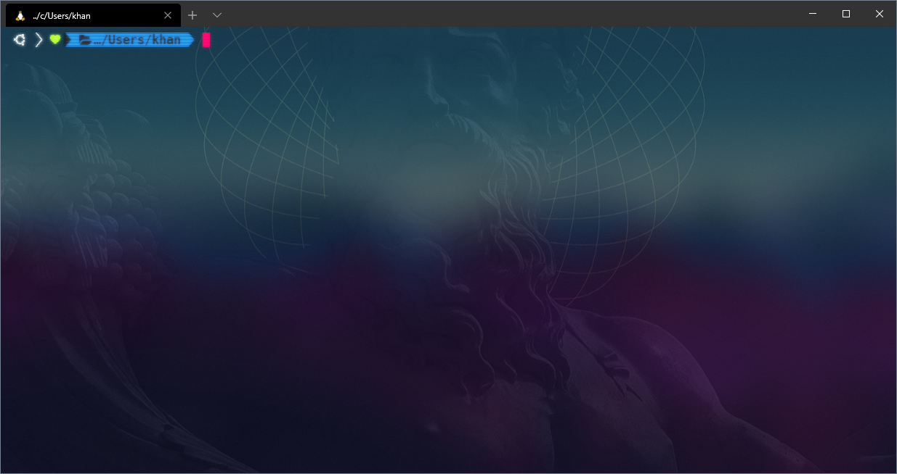
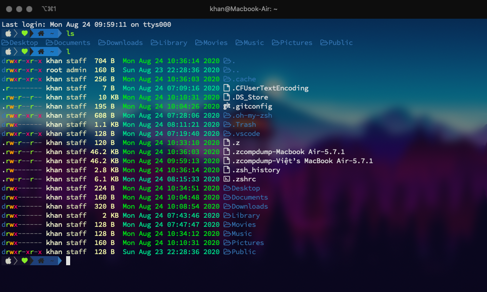

# Settings

Created: Aug 21, 2020 12:33 PM
Include Wallpapers and pre-configured files

# Windows 10

## Install Microsoft WSL 2 + Linux Distribution
    https://docs.microsoft.com/en-us/windows/wsl/install-win10

## Install Windows Terminal

install Windows Terminal on Microsoft Store

More details:
    https://github.com/microsoft/terminal

### Themes 

https://allthings.how/windows-terminal-themes-light-dark-colorful/

recommended: 'Monokai Seti Dark'

        {    
            "name": "Monokai Seti Dark",
            "foreground": "#F8F8F2",
            "background": "#151718",
            "black": "#151718",
            "brightBlack": "#625e4c",
            "blue": "#9D65FF",
            "brightBlue": "#9D65FF",
            "cyan": "#58D1EB",
            "brightCyan": "#58D1EB",
            "green": "#98F424",
            "brightGreen": "#98F424",
            "purple": "#F4005F",
            "brightPurple": "#F4005F",
            "red": "#F4005F",
            "brightRed": "#F4005F",
            "white": "#F8F8F2",
            "brightWhite": "#f6f6ef",
            "yellow": "#FA8419",
            "brightYellow": "#FA8419"
        }

example:

        "defaults":
        {
            // Put settings here that you want to apply to all profiles.
            "colorScheme": "Monokai Seti Dark",
            "closeOnExit": "graceful",
            "cursorShape":"filledBox",
            "cursorColor":"#F4005F",
            "fontFace": "Hack Nerd Font",
            "fontSize": 12,
            "fontWeight": "bold",
            "historySize": 9001,
            "padding": "8, 8, 8, 8",
            "antialiasingMode": "grayscale",
            "snapOnInput": true,
            "startingDirectory": "%USERPROFILE%",
            "useAcrylic": true,
            "acrylicOpacity": 0.5,
            "backgroundImage": "",
            "experimental.retroTerminalEffect": true
        },

### Install essential programs:

1. VS Code
2. IDM
3. WinRAR
4. BitTorrent Web
5. Gomplayer plus
6. TeraCopy

# MacOS
## Installing Iterm2
MacOS's intergrated terminal works just fine, but iTerms2 has more customization options

    https://www.iterm2.com/downloads.html

# Configuring Terminal

## 1. Install ZSH

### Ubuntu:

    sudo apt-get install zsh   

- set your ZSH as default shell:

        chsh -s $(which zsh)

### MacOS

Skip this step if you are on MacOS Catalina and above

    brew install zsh

## 2. Install Oh-My-ZSH

https://ohmyz.sh/#install

    sh -c "$(curl -fsSL https://raw.github.com/ohmyzsh/ohmyzsh/master/tools/install.sh)"

### Plug-ins

- zsh-autosuggestions

        git clone https://github.com/zsh-users/zsh-autosuggestions ${ZSH_CUSTOM:-~/.oh-my-zsh/custom}/plugins/zsh-autosuggestions

- zsh-syntax-highlighting

        git clone https://github.com/zsh-users/zsh-syntax-highlighting.git $ZSH_CUSTOM/plugins/zsh-syntax-highlighting

- zsh-z

        git clone https://github.com/agkozak/zsh-z $ZSH_CUSTOM/plugins/zsh-z

## 3. Install Powerlevel10k

https://github.com/romkatv/powerlevel10k

    git clone --depth=1 https://github.com/romkatv/powerlevel10k.git ${ZSH_CUSTOM:-$HOME/.oh-my-zsh/custom}/themes/powerlevel10k

## 4. Install Nerd Fonts

https://www.nerdfonts.com/
For best support and less bugs please consider using:

    Hack Nerd Font || SauceCodePro Nerd Font

## 5. Customize / clone `.zshrc` from this GitHub repo
https://github.com/kl14n/Personal-Configuration-Backup

# Extras 
## Packages, plug-ins, formulae,...

- python3
- lsd: supercharged lscolor
- neovim
- Node

## Trivial
1. To see how different colors look in your terminal, run the following command:

        for i in {0..255}; do print -Pn "%K{$i}  %k%F{$i}${(l:3::0:)i}%f " ${${(M)$((i%6)):#3}:+$'\n'}; done

2. You can time your shell's start up time with
        
        for i in $(seq 1 15); do /usr/bin/time $SHELL -i -c exit; done

    

## Extravagent mode (optional)

just for fun:

1. add background image
2. retro effects on Windows Terminal

### Set up
put this in the `defaults` profiles in Windows Terminal `Settings.json`

        "useAcrylic": true,
        "acrylicOpacity": 0.5,
        "backgroundImage": "<path to imange",
        "backgroundImageOpacity": 0.2,
        "experimental.retroTerminalEffect": true

## Results
### Windows

### Macbook

